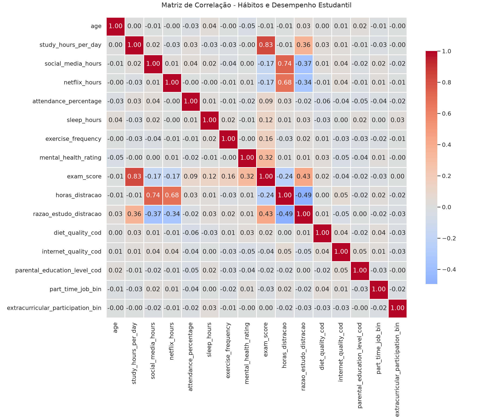
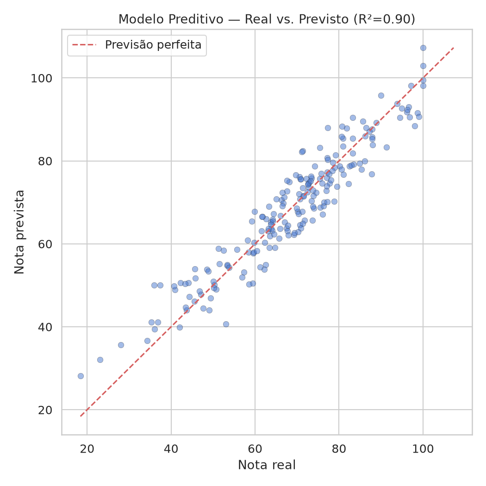
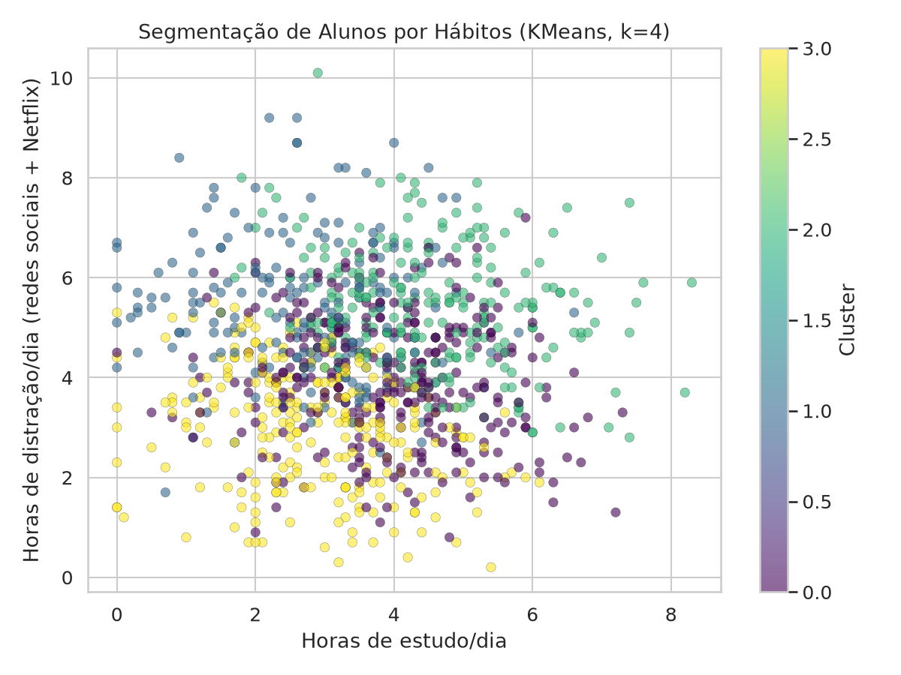
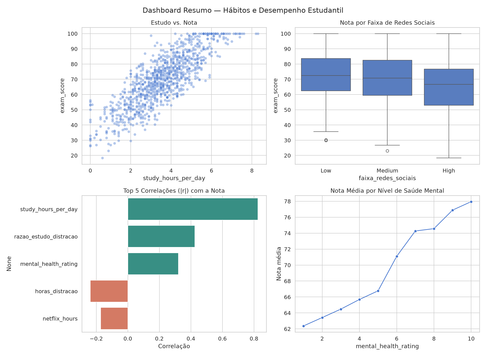

# Desafio Analytics Engineer — Klubi

Este repositório documenta a resolução do desafio técnico para a vaga de Analytics Engineer (Estágio) na Klubi. O objetivo principal deste projeto é explorar, tratar e analisar uma base de dados que mapeia os hábitos e o desempenho acadêmico de 1.000 alunos, visando extrair padrões de comportamento e insights acionáveis.

## Resumo Executivo

- **O que mais explica a nota:** horas de estudo por dia (`study_hours_per_day`) é, disparado, o hábito com maior relação com o desempenho (correlação de **+0.825**) — no modelo preditivo, cada hora extra de estudo soma **~9.5 pontos** na nota prevista, mantendo os demais hábitos constantes.
- **O que mais dá risco:** tempo total de tela (redes sociais + Netflix somados) tem correlação negativa maior do que cada distração isolada — o efeito é cumulativo, não pontual.
- **Saúde mental importa tanto quanto hábito de estudo em certas faixas:** alunos que se autoavaliam com saúde mental 1 (pior) têm nota média de 62.4, contra 78.0 entre os que se avaliam 10 (melhor) — uma diferença de quase 16 pontos.
- **Recomendação prática:** priorizar intervenções que protejam tempo de estudo e reduzam tempo de tela combinado, usando os perfis de cluster (Tarefa 4) para direcionar ações por grupo em vez de campanhas genéricas.

## Como Executar o Projeto

1. **Pré-requisitos:** Python 3.8+ e `pip`.
2. **Crie e ative um ambiente virtual (opcional, mas recomendado):**
   ```bash
   python -m venv .venv
   source .venv/bin/activate  # no Linux/Mac
   ```
3. **Instale as dependências:**
   ```bash
   pip install -r requirements.txt
   ```
4. **Execute a pipeline completa (Tarefas 1 a 6):**
   ```bash
   python analise_completa.py
   ```
   Isso gera todos os gráficos, CSVs auxiliares e a síntese de insights dentro da pasta `outputs/`, organizada por tarefa (`01_exploracao/`, `02_engenharia/`, ..., `06_insights/`).

5. **(Diferencial) Rode o simulador interativo:**
   ```bash
   streamlit run app_streamlit.py
   ```
   Abre um app onde é possível ajustar os hábitos de um aluno hipotético (horas de estudo, redes sociais, sono, saúde mental etc.) e ver a nota prevista pelo modelo em tempo real.

---

## Relatório de Análise e Desenvolvimento

O desenvolvimento da solução seguiu um fluxo natural: diagnóstico → tratamento → análise estatística → aplicação prática → visualização → síntese.

### 1. Exploração e Qualidade dos Dados

O ponto de partida do projeto consistiu em mapear o cenário dos dados fornecidos. A base contempla 1.000 registros sem nenhuma linha duplicada, distribuídos entre 16 variáveis. Estas variam desde características demográficas (idade, gênero e nível de escolaridade dos pais) até hábitos diários (horas dedicadas a estudos, lazer e exercícios), culminando no nosso alvo preditivo: a nota final do aluno (`exam_score`).

Uma auditoria da qualidade revelou um dataset bem íntegro: os valores mantinham coerência semântica e não exibiam falhas extremas como horas diárias negativas ou notas fora do intervalo 0–100. A única exceção foi a variável que indica a escolaridade dos pais (`parental_education_level`), que possuía cerca de 9,1% de valores ausentes (91 registros).

### 2. Transformação e Engenharia de Variáveis

Para tratar os nulos na coluna sobre a escolaridade parental, e considerando se tratar de uma categoria ordinal de baixo impacto nulo, optou-se pela imputação através da **moda** (categoria *"High School"*). O método foi preferido em relação à criação de uma categoria "Desconhecida", pois protege o dataset contra ruídos prematuros, mantendo a integridade distributiva original. Uma rápida verificação confirmou a validade da técnica: a média de nota geral entre o grupo íntegro (69.6) e o que continha falhas (70.0) se mostrou quase idêntica, descartando ausências com viés comportamental oculto.

Com os dados consistentes, avançamos para a criação de variáveis derivadas para facilitar análises dimensionais. A métrica de `horas_distracao` (somatório de tempo em redes sociais e Netflix) foi elaborada junto da `razao_estudo_distracao`. Esta razão serve como um excelente KPI: quantifica de imediato a dominância dos estudos ou do lazer no cotidiano de cada aluno. A conversão de atributos categóricos literais (como `diet_quality` ou `internet_quality`) em correspondentes ordinais, a divisão temporal em bandas (High, Medium, Low) e a codificação binária de campos Sim/Não (`part_time_job`, `extracurricular_participation`) formaram a preparação final do conjunto, hoje estruturado para interpretações matemáticas diretas e para alimentar o modelo preditivo da Tarefa 4.

### 3. Análises Estatísticas e Fatores de Influência

Superado o polimento dos dados, submetemos a amostra ampliada a um cálculo de correlação de Pearson (excluindo identificadores como `student_id`, que não carregam sinal). O resultado esclareceu matematicamente as dinâmicas de dedicação estudantil e como elas de fato se interligam ao sucesso nas avaliações.

O **maior impulsionador de sucesso** de longe reside no compromisso linear com o estudo. A variável `study_hours_per_day` apresenta uma fortíssima correlação positiva (**+0.825**) com a nota. Complementando isso, a nossa métrica recém-criada, `razao_estudo_distracao`, despontou como a segunda força de maior impacto (**+0.425**), mostrando que além de acumular horas brutas de livro, blindar esse tempo perante o ócio impulsiona notas altas. O terceiro fator de impacto é a estabilidade mental (`mental_health_rating`, em **+0.322**), atestando a importância do bem-estar.

No lado inverso, o tempo cedido às distrações constitui o **maior dreno de pontuação**. A consolidação total de tempo em tela (`horas_distracao`) figura como a correlação de base mais negativa (**-0.238**). Se o analisarmos fracionado, o streaming de vídeo (`netflix_hours`, com **-0.172**) e as redes sociais (`social_media_hours`, com **-0.167**) punem o rendimento escolar de forma praticamente equiparável — reforçando que o efeito é cumulativo, não isolado a um único hábito.



### 4. Aplicações Práticas

Duas aplicações concretas foram construídas em cima da análise, cada uma apoiando uma decisão diferente:

**A. Modelo preditivo (Regressão Linear).** Treinado sobre os hábitos do aluno (estudo, redes sociais, Netflix, sono, exercício, frequência, saúde mental, dieta, internet, escolaridade dos pais) para estimar `exam_score`, com desempenho de **R² = 0.900 / MAE = 4.11 pontos** no conjunto de teste (valores impressos ao rodar `analise_completa.py`). Os coeficientes mostram o peso de cada hábito, mantendo os demais constantes:

| Hábito | Coeficiente | Leitura |
|---|---|---|
| `study_hours_per_day` | **+9.54** | +1h de estudo/dia → +9.5 pontos |
| `social_media_hours` | **-2.70** | +1h de redes sociais/dia → -2.7 pontos |
| `netflix_hours` | **-2.32** | +1h de Netflix/dia → -2.3 pontos |
| `sleep_hours` | **+1.98** | +1h de sono/dia → +2.0 pontos |
| `mental_health_rating` | **+1.95** | +1 ponto na escala de saúde mental → +2.0 pontos |
| `exercise_frequency` | **+1.32** | +1 dia de exercício/semana → +1.3 pontos |
| `diet_quality_cod` | -0.32 | efeito marginal |
| `attendance_percentage` | +0.14 | efeito marginal |
| `internet_quality_cod` | -0.11 | efeito marginal |
| `parental_education_level_cod` | +0.03 | efeito desprezível |

Isolando o efeito de cada hábito (a favor de manter os demais fixos), estudo continua sendo a alavanca mais forte, mas o modelo também confirma que **1h de estudo "vale" mais do que 1h a menos de distração** — reduzir redes sociais ajuda, mas não substitui estudar de fato.

*Quem usaria:* orientadores acadêmicos ou o time de monitoria da Klubi, aplicando o modelo a um formulário de hábitos de um aluno novo (ou no início do semestre) para **priorizar quem deve receber apoio antes que a nota caia de fato**.



**B. Segmentação de alunos (KMeans, k=4).** Agrupa os alunos por padrão de hábitos (estudo, distração total, sono, saúde mental) em perfis que vão de alto desempenho a risco. A tabela de perfis (`outputs/04_aplicacoes/perfis_clusters.csv`) traz, para cada cluster, as médias de hábito e a nota média associada.
*Quem usaria:* o time pedagógico/CX, para **direcionar ações diferentes por perfil** — campanhas de bem-estar e gestão de tempo de tela para o grupo de risco, grupos de estudo em par para o grupo equilibrado, mentoria de pares para o grupo de alto desempenho — em vez de uma comunicação genérica para toda a base.



**C. (Diferencial) Simulador interativo (`app_streamlit.py`).** App em Streamlit que usa o mesmo modelo preditivo: o usuário ajusta os hábitos com sliders e vê, em tempo real, a nota esperada e onde esse aluno hipotético se posiciona em relação à distribuição dos 1.000 alunos da base. Pensado para uma conversa de orientação (`"e se você dormisse mais 1h e reduzisse redes sociais?"`) em vez de uma tabela estática.

🔗 **App publicado:** https://data-analysis-challenge-klubi-gifnoquxeiu9rk8uxhrhdc.streamlit.app/

### 5. Visualização

Além do mapa de calor de correlação (Tarefa 3), foram gerados:

- **Análise detalhada da variável de maior impacto** (`study_hours_per_day` vs. `exam_score`, com linha de regressão) — `outputs/05_visualizacao/impacto_study_hours_per_day.png`.
- **Comparação por faixas** — boxplot de `exam_score` por `faixa_redes_sociais` (Low/Medium/High) — `outputs/05_visualizacao/boxplot_faixa_redes_sociais.png`.
- Extras: boxplot por gênero, histograma de horas de estudo por faixa de desempenho, e um **dashboard-resumo** (diferencial) consolidando os 4 gráficos principais em uma única figura.



### 6. Síntese de Insights

A pipeline gera automaticamente, em `outputs/06_insights/sintese_insights.md`, um relatório com os hábitos de maior correlação, diferenças entre grupos e recomendações. Os principais achados:

**Diferenças entre grupos:**
- **Gênero:** nota média praticamente equivalente entre os grupos (Female 69.7, Male 69.4, Other 70.6) — a diferença é pequena o suficiente para não indicar, isoladamente, um viés relevante de gênero na base.
- **Saúde mental:** a nota média sobe de forma quase monotônica com a autoavaliação de saúde mental — de 62.4 (nível 1) a 78.0 (nível 10), uma diferença de **15.6 pontos** entre os extremos. É o grupo com a maior disparidade encontrada em toda a análise.
- **Trabalho meio período:** quem trabalha tem nota média levemente menor (68.7 vs. 69.8) — uma diferença pequena, mas consistente com a hipótese de que menos tempo disponível compete com o estudo.

**Recomendações práticas:**
1. **Proteger horas de estudo** é a alavanca de maior retorno (+9.5 pontos por hora extra, segundo o modelo).
2. **Vigiar o tempo total de tela**, não só redes sociais isoladamente — o efeito é cumulativo.
3. **Tratar saúde mental como alavanca de desempenho**, não só de bem-estar — é a segunda maior disparidade de nota entre grupos encontrada na base.
4. **Usar os perfis de cluster** para segmentar intervenções em vez de campanhas genéricas de estudo.

### 7. Limitações e Próximos Passos

- **Correlação não implica causalidade.** Hábitos como sono e saúde mental podem ser tanto causa quanto efeito de um bom (ou mau) desempenho. A base não permite distinguir a direção da relação.
- **Regressão linear assume relações lineares e aditivas** entre os hábitos. Um modelo não-linear (ex.: Random Forest ou Gradient Boosting) provavelmente capturaria interações entre variáveis (ex.: o efeito de redes sociais pode depender do nível de saúde mental) e serviria como comparação de robustez.
- **A base é uma amostra única (1.000 alunos) sem dimensão temporal.**  Não é possível avaliar se os hábitos de um mesmo aluno ao longo do tempo têm o mesmo efeito que a variação observada entre alunos diferentes.
- **Próximo passo natural:** validação cruzada (k-fold) no lugar de um único split treino/teste, para checar a estabilidade do R² e dos coeficientes.

---

## Estrutura do Projeto

```
.
├── analise_completa.py           # Pipeline com as Tarefas 1 a 6
├── app_streamlit.py               # Simulador interativo (diferencial)
├── habitos_e_desempenho_estudantil.csv
├── dados_transformados.csv        # Gerado pela Tarefa 2
├── requirements.txt
├── enunciado.md
├── outputs/
│   ├── 01_exploracao/
│   ├── 02_engenharia/
│   ├── 03_estatistica/
│   ├── 04_aplicacoes/
│   ├── 05_visualizacao/
│   └── 06_insights/
└── README.md
```
